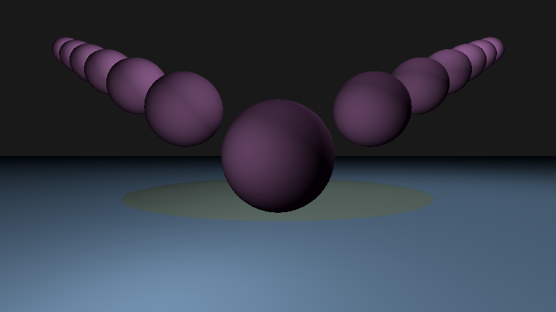
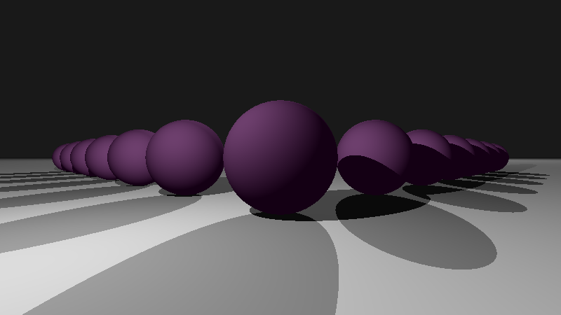

### Python ray tracer: example image series

Sequential images include optical effects from ambient light only to shadows and indirect lighting.

  

### This code
- an exercise, not intended for production use
  - !not! performance optimized: ray tracing is computationally expensive and this implementation is slow
- core algorithm:
```    
    for j in range(display_height):
        yd = yd_from_j(j, display_height, display_width)
        for i in range(display_width):
            xd = xd_from_i(i, display_width)
            pixel_ray = Ray(c.center, [xd, yd, zd])
            t, hit_point, hit_element = find_nearest(pixel_ray, scene + lights)
            if hit_element != 0:
                c_ambient = ambient_contrib(hit_element)
                c_diffuse = diffuse_contrib(hit_point, hit_element)
                c_fresnel = fresnel_contrib(t, hit_point, pixel_ray.direction, hit_element, recursion_depth)
                color_xy = c_ambient + c_diffuse + c_fresnel
            else:
                color_xy = background_color
            img[j, i, :] = color_xy
            colors = colors + ' ' + str(color_xy)
```
- diffuse surface scattered (Lambertian) and indirect/recursive (Fresnel) contributions are computed based on the physics of light transport
  - NB: light information is carried by photons and the ray approximation in ray tracing is a design choice, trading off render precision for reduced computational expense

References: 
- [An improved illumination model for shaded display (Whitted)](https://www.cs.drexel.edu/~david/Classes/Papers/p343-whitted.pdf)
- [Computer Graphics from Scratch - Ray Tracing Overview (scratchapixel)](https://www.scratchapixel.com/lessons/3d-basic-rendering/ray-tracing-overview)

#### Ray tracing basics
- A 3D scene volume is rendered to a 2D display based on physics-based in-scene optical interactions
  - map* each 2D display position (pixel) to a nearest in-scene hit point of the extended ray passing through the pixel from the camera
  - starting from the hit point, recursively ray-trace reflection and refraction rays that contribute to the hit point color value:
    - using the Fresnel equations, compute reflected and refracted rays from the 'hit' point
    - follow these two rays, recursively generating new reflection and refraction rays at each subsequent scene element intersection, until a ray intersects a light source (or the computation times out)
  - integrate over all light contributions to the initial nearest hit point to set the associated pixel's color value
    - ambient, diffuse surface scattering, occlusion/shadows, indirect light (prior reflection and refraction contributions, computed recursively)
```
                    Ambient Light
                    |||||||||||||||||||||||||||||||||||||||
                    |||||||||||||||||||||||||||||||||||||||
                                                        ====
                Display Plane                           ====
                    |\              _____               ====
                    | \            /     \   Scene      ====
                    |  \          /       \   Objects   ====
        Camera      |   \        (         )            ====
        |           |    \        \       /     ______  ====
        O)- - - - - |- >  \ - - - *\     /     (      ) ====
        |            \    |          ---        (    )  ====
                      \   |                      (  )   ====
                       \  |                       --    ====
                        \ |                             ====
                         \|                             ====
                                      ***   Scene
                                      ***   Light
```
* map 3D -> 2D:
  - parametrize ray as a line between a virtual camera/eye** and the scene pixel: ray = ray.origin + t * ray.direction
  - compute the nearest intersection between the line and all scene elements (i.e., find the nearest 'hit')
  - ** the camera and scene are on opposite sides of the display plane

#### Display plane
- The number and arrangement of display plane pixels is:
  - n_vertical_pixels * n_horizontal_pixels
- Pixel values represent color as [red, green, blue]. 

#### Scene elements
- spheres
- planes
- lights

#### Input
- Scene elements represented by classes
- Generate class instances, specifying attributes: e.g., position, surface normal, color, Fresnel coefficients (reflectivity, index of refraction)

#### Output: image file
- With matplotlib, a .png file is generated via imsave().
- If no matplotlib, can write to .ppm file, [formatted as](http://netpbm.sourceforge.net/doc/ppm.html):
  - P3 (width: int) (height: int) 'r' 'g' 'b' 'r' 'g' 'b'  ... 'r' 'g' 'b' \n
    - for .ppm files, 'r' 'g' 'b'  are each in (usually) range(256) (and maximally limited to range(2^16))

#### Dependencies
- Modules:
  - numpy
  - matplotlib
  - time (optional)

### Use
- download main.py -> command line: $ python3 main.py
- Run time:
  - !!NB!! display_scale parameter adjustment will determine execution time:
    - display default is 16:9 * display_scale
    - run time scales with number of pixels, so with display_scale**2 
  - WARNING: ray tracing is computationally expensive and, in its current state, this code is not suitable for real-time frame generation
    - Nvidia has some great tech and resources for real time image generation incorporating ray tracing: [Intro to NVIDIA RTX and DirectX ray tracing tech](https://developer.nvidia.com/blog/introduction-nvidia-rtx-directx-ray-tracing/)

License: MIT

Language: Python (built on python 3.9.7)
