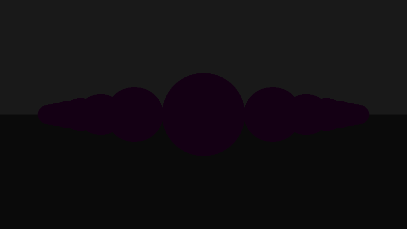
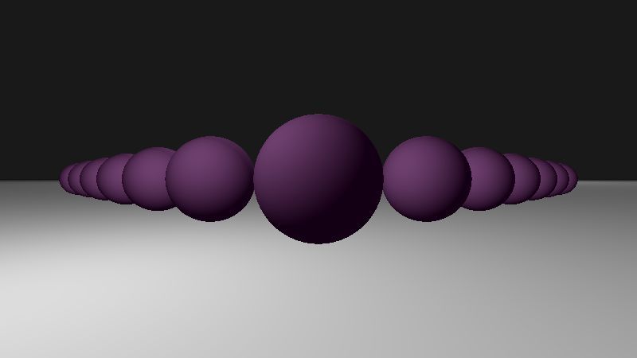

### Python ray tracing engine
- Render a 3D scene by simulating its illumination
- For each output image pixel, in-scene optical interactions are computed to determine the color of the pixel's incoming light ray
  - NB: computationally intensive
  - this implementation is *not* performance optimized via parallelization, bounding volumes, etc.
  - run time depends on image size and recursion depth

### Use
- $ python3 main.py
- Output/image file: raytray.png
- Run time:
  - scales with 'display_scale' and recursion 'depth' parameters:
    - display size (default): [16:9] scaled by display_scale
      - run time scales with number of pixels: display_scale**2
  - WARNING: ray tracing is computationally expensive and, in its current state, this code is not suitable for real-time frame generation
    - example images generated with recursion depth = 0 (no Fresnel components) and display_scale = 50 on a 2015 MacBookPro running on Mojave 10.14.6 with a 2.9 GHz Intel Core i5 processor:
      ```
      Image saved as raytray_image.png
      Display: 800 x 450
      Time to compute: 536.0476911067963 s
      ```

### Python ray tracer: example image series

This sequence of images demonstrates the evolution of a ray traced image with incremental additions of different optical contributions: ambient, diffuse surface scattering, shadows/occlusion, recursively traced reflection/refraction.

  

### This code
- Not intended for production use
  - !not! performance optimized: ray tracing is computationally expensive and this implementation is slow
- Core logic:
```    
    for j in range(display_height):
        yd = yd_from_j(j, display_height, display_width)
        for i in range(display_width):
            xd = xd_from_i(i, display_width)
            pixel_ray = Ray(c.center, [xd, yd, zd])
            t, hit_point, hit_element = find_nearest(pixel_ray, scene + lights)
            if hit_element != 0:
                c_ambient = ambient_contrib(hit_element)
                c_diffuse = diffuse_contrib(hit_point, hit_element)
                c_fresnel = fresnel_contrib(t, hit_point, pixel_ray.direction, hit_element, recursion_depth)
                color_xy = c_ambient + c_diffuse + c_fresnel
            else:
                color_xy = background_color
            img[j, i, :] = color_xy
```
- Diffuse surface scattered (Lambertian) and indirect/recursive (Fresnel) contributions are physics-based
  - NB: light information is carried by photons and the ray approximation in ray tracing is a design choice, trading off render precision for reduced computational expense

References: 
- [An improved illumination model for shaded display (Whitted)](https://www.cs.drexel.edu/~david/Classes/Papers/p343-whitted.pdf)
- [Computer Graphics from Scratch - Ray Tracing Overview (scratchapixel)](https://www.scratchapixel.com/lessons/3d-basic-rendering/ray-tracing-overview)
- Nvidia has some great tech and resources for real time image generation incorporating ray tracing: [Intro to NVIDIA RTX and DirectX ray tracing tech](https://developer.nvidia.com/blog/introduction-nvidia-rtx-directx-ray-tracing/)
- [Radiance Caching for Real-Time Global Illumination](https://youtu.be/2GYXuM10riw): Daniel Wright (Engineering Fellow in graphics at Epic Games) at SIGGRAPH 2021

#### Ray tracing basics
- A 3D scene volume is rendered to a 2D display based on physics-based in-scene optical interactions
  - map* each 2D display position (pixel) to the nearest in-scene hit point
  - starting from the hit point, recursively ray-trace reflection and refraction rays that contribute to the hit point color value:
    - using the Fresnel equations, compute reflected and refracted rays from the hit point
    - follow these two rays, recursively generating new reflection and refraction rays at each subsequent scene element intersection, until a ray intersects a light source (or the computation times out)
  - integrate over contributions to the initial nearest hit point to set the associated pixel's color value:

    ```ambient + diffuse surface scattering (considering occlusion/shadows) + indirect light (prior reflection and refraction contributions, computed recursively)```

```
                    Ambient Light
                    |||||||||||||||||||||||||||||||||||||||
                    |||||||||||||||||||||||||||||||||||||||
                                                        ====
                Display Plane                           ====
                    |\              _____               ====
                    | \            /     \   Scene      ====
                    |  \          /       \   Objects   ====
        Camera      |   \        (         )            ====
        |           |    \        \       /     ______  ====
        O)- - - - - |- >  \ - - - *\     /     (      ) ====
        |            \    |          ---        (    )  ====
                      \   |                      (  )   ====
                       \  |                       --    ====
                        \ |                             ====
                         \|                             ====
                                      ***   Scene
                                      ***   Light
```
* map 3D -> 2D:
  - parametrize ray as a line between a virtual camera/eye (at an observer position, in front of the display) and the scene pixel: 
    - Point-on-ray-trajectory = ray.origin + t * ray.direction
  - compute the nearest intersection between the line/ray and all scene elements (i.e., find the nearest 'hit')
  - assign the pixel color value based on illumination of the intersection/nearest 'hit'

#### Display plane
- The number and arrangement of display plane pixels is:
  - n_vertical_pixels * n_horizontal_pixels

#### Scene elements
- spheres
- planes
- lights

#### Input
- Scene elements represented by classes
- Create the scene by generating class instances, specifying attributes: e.g., position, surface normal, color, Fresnel coefficients (reflectivity, index of refraction)

#### Output: image file
- With matplotlib, a .png file is generated via imsave().
- If no matplotlib, can write to .ppm file, [formatted as](http://netpbm.sourceforge.net/doc/ppm.html):
  - P3 (width: int) (height: int) 'r' 'g' 'b' 'r' 'g' 'b'  ... 'r' 'g' 'b' \n
    - for .ppm files, 'r' 'g' 'b'  are each in (usually) range(256) (and maximally limited to range(2^16))

#### Dependencies
- Python modules (all imported in main.py):
  - math
  - numpy
  - matplotlib
  - time (optional)

License: MIT

Language: Python (built on python 3.9.7)
